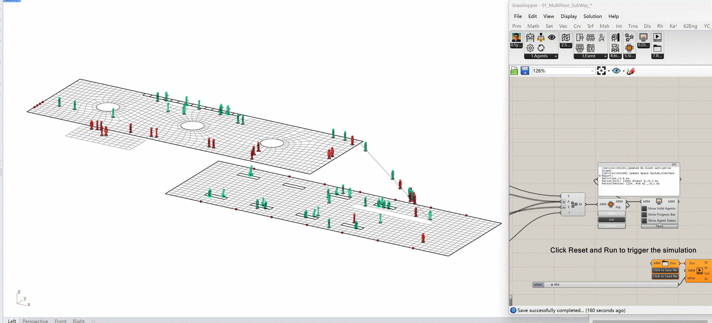

# BSim - Behaviour Simulator

__The Behaviour Simulator is an agent-based model framework designed as a plugin for Rhino software. This implementation offers a lightweight and easily customizable system, enabling users to define agent behaviors and explore system dynamics through simulations. The development is implemented as a plug-in for the CAD environment [McNeel Rhino/Grasshopper](https://www.rhino3d.com/) for both Windows and MacOS.__

__This library is developed and maintained by:__
- __Yuchi Shen__ [Southeast University of Nanjing, School of Architecture](http://arch.seu.edu.cn/jz_en/main.htm)
- __Mengting Zhang__ [City University of Macau, Faculty of Innovation and Design](https://fiad.cityu.edu.mo/)

 

__If you use the BSim library, please reference the official GitHub repository:__

  @Misc{BSim2024,  
  author = {Shen, Yuchi; Zhang, Mengting and Cheng, Shi},  
  title = {{BSim: Behaviour Simulator}},  
  year = {2024},  
  note = {Release 1.00 Beta},  
  url = { https://github.com/YuchiSHEN/BSim.git },  
  }
  
**This library makes use of the following libraries:**
1. [Kangaroo2](https://www.rhino3d.com/) by Daniel Piker. [For the physical system in ABM]
  
[To install  BSim, please copy the folder "BSim.dll" to any address in the computer, and link all the components to this dll. If you work on Windows, please make sure that the files are unlocked.]

## Publications related to the BSim project include:
1. __Shen Yuchi*, Xinyi Hu, Xiaotong Wang, Mengting Zhang, Lirui Deng ,Wei Wang*__: [Integrated framework for space-and energy-efficient retrofitting in multifunctional buildings: A synergy of agent-based modeling and performance-based modeling, Building Simulation, Build. Simul. 17, 1579–1600 (2024).](https://doi.org/10.1007/s12273-024-1148-z) 

## Quick Start:
***You can following guidelines to know the BSim framework:***
[The framework and structure of the BSim](/manual/Framework.md)
